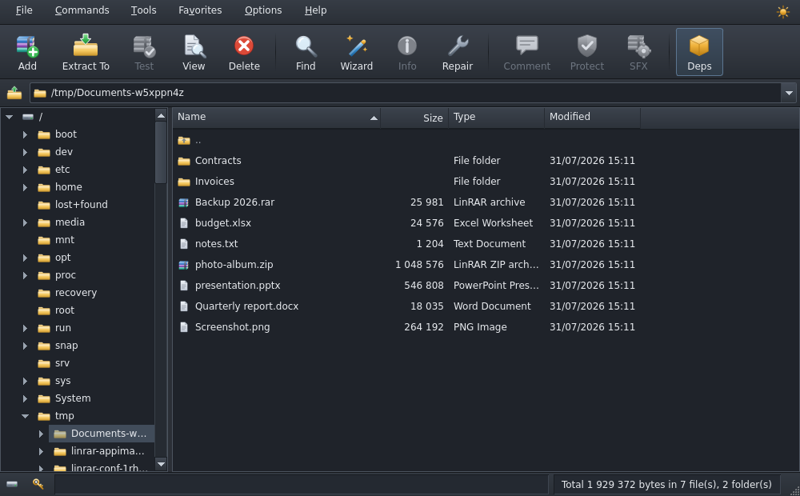

<div align="center">


# LinRAR

**A native WinRAR for Linux.**

Clone it, run one script, and you have the classic WinRAR interface — the same
dialogs, the same keyboard shortcuts, the same right-click menu — running
natively on your desktop.

[](https://github.com/suryanarayanrenjith/LinRAR/actions/workflows/tests.yml)
[](LICENSE)
[](https://www.python.org/)
[](https://pypi.org/project/PyQt6/)

</div>

<table>
<tr>
<td width="50%"></td>
<td width="50%"></td>
</tr>
<tr>
<td align="center"><em>Light theme</em></td>
<td align="center"><em>Dark theme</em></td>
</tr>
</table>

RARLAB ships only command line binaries for Linux; there has never been a
native WinRAR GUI. LinRAR is that GUI, built with PyQt6 on top of `rar`,
`unrar`, `7z` and `zip`.

---

## Contents

- [Install](#install)
- [Setting up the tools](#setting-up-the-tools) — **start here after installing**
- [What it does](#what-it-does)
- [Right-click menu and command line](#right-click-menu-and-command-line)
- [Documentation](#documentation)

---

## Install

```bash
git clone https://github.com/suryanarayanrenjith/LinRAR.git
cd LinRAR
./install.sh
```

That is the whole setup. The installer creates the virtual environment,
installs the command line tools LinRAR drives (asking for your password once),
puts a `linrar` launcher on your `PATH`, installs the icon at nine sizes, adds
LinRAR to the application menu, registers it as the handler for archive files,
wires **Extract here / Extract to… / Add to archive…** into your file manager's
right-click menu, and finishes by starting the app once to prove it works.

```bash
linrar          # or pick LinRAR out of your application menu
```

| Command | What it does |
|---|---|
| `./install.sh` | install for the current user (default) |
| `./install.sh --system` | install for every user, in `/usr/local` |
| `./install.sh --no-deps` | set up the app only, skip the system packages |
| `./install.sh --reinstall` | install again over an existing install, or repair one |
| `./install.sh --status` | is it installed? what version, when, from where? |
| `./install.sh -y` | answer yes to everything |
| `./uninstall.sh` | remove all of it, `.venv` included |

**It installs once.** Run `./install.sh` a second time and it tells you what is
already there and stops, without touching a thing — `--reinstall` is how you
say you meant it. `./uninstall.sh` refuses just the same when there is nothing
installed to remove. Both keep a receipt (`.install-receipt`) so they know.

`uninstall.sh` reverses every file the installer wrote — launcher, desktop
entry, icons, MIME defaults, right-click entries and the virtual environment —
from a manifest it kept, and leaves the project folder for you to delete.

**Settings for every user.** `/etc/linrar/linrar.conf` (plus `conf.d`
drop-ins) sets defaults for everyone on the machine, and can *lock* the ones
that are not up for discussion — a locked setting is greyed out everywhere it
appears in the app, with a tooltip naming the file. `linrar --config-info`
prints what is in force and where each value came from. See
[Settings for every user](docs/USAGE.md#settings-for-every-user).

**Distributions.** APT, DNF/YUM, Pacman, Zypper, APK, XBPS, eopkg, Portage,
swupd, slackpkg, `rpm-ostree` (Silverblue, Kinoite, Bazzite) and NixOS are all
recognised, with fallbacks for when a PyQt6 wheel will not build, when `venv`
or `pip` is missing, and when a Wayland session has no Qt Wayland plugin.
[docs/INSTALL.md](docs/INSTALL.md) has the details and the troubleshooting.

---

## Setting up the tools

LinRAR is a **front end**. It draws the interface, decides what to do, and
hands the actual compression to the programs RARLAB and others ship for Linux.
Which of those you have installed decides what LinRAR can do — so this is the
first thing to look at after installing, and LinRAR gives you one place to
manage all of it.

`install.sh` already offers to install everything. The **Dependencies** manager
is where you check the result, add what you skipped, and fix anything your
distribution did not have.

### Opening it

The **Deps** button sits on the toolbar, called out in amber because it is the
one button a new user needs:

<div align="center">

</div>

It turns **red, with a warning badge**, whenever something required is missing,
and its tooltip names what. You will also find it under **Tools →
Dependencies**.

### What you are looking at

<div align="center">

</div>

The top panel reports what LinRAR worked out about your system: the
distribution, the package manager it will drive, and how it will ask for
administrator rights.

The table lists every component, where it was found, and which package provides
it **on your distribution** — package names differ, and LinRAR carries them for
each of the nine package managers it can drive. Status reads:

| Status | Meaning |
|---|---|
| **Installed** (green) | found and working; the version and path are shown |
| **Missing** (red) | a required component — some things simply will not work |
| **Not installed** (amber) | optional; the features it powers are unavailable |

Selecting a row explains what that component does, plus anything specific to
your distribution — that `rar` lives in *multiverse* on Ubuntu, in *RPM Fusion*
on Fedora, or in the AUR on Arch, for instance.

### The six components

| Component | Enables | Without it |
|---|---|---|
| **UnRAR** | reading, extracting and testing RAR archives | `.rar` files cannot be opened at all |
| **RAR** | creating and modifying RAR: compression, recovery records, locking, SFX | RAR archives are read-only |
| **7-Zip** | 7z, TAR, GZip, BZip2, XZ, ISO and CAB | those formats are unavailable |
| **Zip** | password-protected (AES) ZIP creation | plain ZIP still works — that is built in |
| **SquashFS tools** | building self-extracting AppImages | *Convert to AppImage* is unavailable |
| **Keyring** (`secret-tool`) | saving passwords in your desktop keyring | passwords go to LinRAR's own file, obfuscated but **not encrypted** |

Only **UnRAR** and **RAR** are marked required. Everything else quietly widens
what LinRAR can do.

### Installing something

1. Press **Get administrator access**. Package changes need root, and LinRAR
   asks **once**: your desktop's authentication dialog appears (`pkexec`), or
   LinRAR asks for your password if only `sudo`/`doas` is available. The
   password goes straight to the helper and is never stored — a keep-alive
   keeps the authorisation for about fifteen minutes so the rest of your
   session just runs.
2. Select a component and press **Install** — or press **Install all missing**
   to do the lot in one command.
3. The package manager's own output streams into the **Details** pane, so a
   failure shows you exactly what it said rather than a shrug.
4. **Refresh** re-probes everything; LinRAR picks up new tools immediately, with
   no restart.

**Uninstall** removes a component the same way, warning you first when it is
one of the required ones.

### When a package is not available

`rar` is shareware and is not in every repository. If **Install** cannot find
it, install RARLAB's own build anywhere on your system and point LinRAR at it
in **Settings → Tools and system**:

<div align="center">

</div>

Each box shows, in grey, where LinRAR found that tool. Leave it empty and it
keeps searching for itself: your `PATH` first, then `/usr/local/bin`,
`/opt/rar`, `/opt/bin`, `~/.local/bin`, `~/bin`, `/snap/bin` and the Flatpak
and Nix profile directories — under every name these tools ship with (`7z`,
`7zz`, `7za`, `7zr`, `unrar`, `unrar-nonfree`, `unrar-free`), so an unusual
packaging choice is not a dead end. Type a path, or **Browse…**, to pin one
specific binary; **Re-scan** picks up anything you installed outside LinRAR
without restarting it.

The same tab chooses which escalation tool to use and shows where your settings
are kept.

---

## What it does

**Browsing** — browse the filesystem, step *into* an archive and keep browsing.
Folder tree, address bar, sortable columns, five view modes, column chooser,
comment pane, favourites, find, drag and drop.

**Archiving** — the full *Archive name and parameters* dialog: RAR5 / RAR4 /
ZIP / 7z, six compression presets, dictionary sizes, volumes, solid archives,
recovery records, SFX, locking, every update mode, encryption including
encrypted file names, exclusion masks, comments and saved profiles.

**Extraction** — the full *Extraction path and options* dialog, with WinRAR's
*Confirm file replace* prompt. Extracting into a folder you do not own asks for
administrator rights and stages the files, rather than running the archive tool
as root.

**Commands** — Test, View, Save as, Delete, Rename, Find, Info, Properties,
Comment, Protect (recovery record), recovery volumes and reconstruction,
Repair, Lock, Convert to AppImage, batch Convert, reports.

**Themes and customization** — a light and a dark theme drawn by LinRAR itself,
a toolbar you choose the contents and order of, five file-list views, and a
layout you can rearrange. Everything is remembered between launches.

<table>
<tr>
<td width="46%" valign="top"></td>
<td width="54%" valign="top"></td>
</tr>
<tr>
<td align="center" valign="top"><em>Archive name and parameters</em></td>
<td align="center" valign="top"><em>Customize: toolbar, file list, layout</em></td>
</tr>
</table>

Full tour and keyboard shortcuts: [docs/USAGE.md](docs/USAGE.md).

---

## Right-click menu and command line

After installing, archives get LinRAR entries in Dolphin, Nemo, Nautilus, Caja
and Thunar. They all call the same command line, which you can use directly:

```bash
linrar ~/Downloads                 # browse a folder
linrar backup.rar                  # open an archive
linrar --extract-here a.rar b.zip  # unpack each one beside itself
linrar --extract-to  a.rar         # unpack, asking where and how
linrar --add *.txt                 # add the files to a new archive
linrar --test a.rar                # check for damage
linrar --config-info               # where every setting comes from
```

---

## Requirements

**Linux.** LinRAR drives the Linux builds of `rar`, `unrar`, `7z` and `zip`,
keeps its settings in the XDG configuration directories, and registers itself
with a freedesktop.org desktop. The installer, the uninstaller and the
application each check before doing anything and stop with an explanation
anywhere else — on Windows use WinRAR or 7-Zip, on macOS Keka, and under WSL
install inside the Linux distribution rather than on the Windows side.

| Component | Purpose | Required |
|---|---|---|
| Python 3.9+ and PyQt6 | the application itself | yes — the installer handles it |
| `unrar` | read, extract and test RAR archives | yes |
| `rar` | create and modify RAR archives | to write RAR |
| `7z` | 7z, TAR, GZip, BZip2, XZ, ISO, CAB | optional |
| `zip` | password-protected ZIP creation | optional |
| `squashfs-tools` | building self-extracting AppImages | for SFX |
| `secret-tool` | keyring storage for saved passwords | recommended |

None of them need installing by hand — see
[Setting up the tools](#setting-up-the-tools). Plain ZIP reading and writing
needs nothing at all: it is handled in-process by Python.

---

## Documentation

| Document | Covers |
|---|---|
| [docs/INSTALL.md](docs/INSTALL.md) | installing, distributions, file-manager integration, troubleshooting |
| [docs/USAGE.md](docs/USAGE.md) | everything the app does, shortcuts, customization, command line |
| [docs/ARCHITECTURE.md](docs/ARCHITECTURE.md) | how it works inside, and the traps worth knowing about |
| [docs/DEVELOPMENT.md](docs/DEVELOPMENT.md) | running from source, the test suite, project layout |
| [CHANGELOG.md](CHANGELOG.md) | what changed |

---

## Credits

UI built by **Surya** — [surya.is-a.dev](https://surya.is-a.dev/)

LinRAR's own code is MIT licensed ([LICENSE](LICENSE)). It contains no RAR
code: RAR and UnRAR are Copyright © Alexander Roshal, LinRAR simply drives
them, and it is not affiliated with win.rar GmbH.
