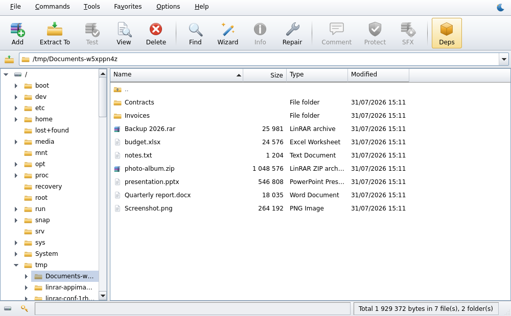
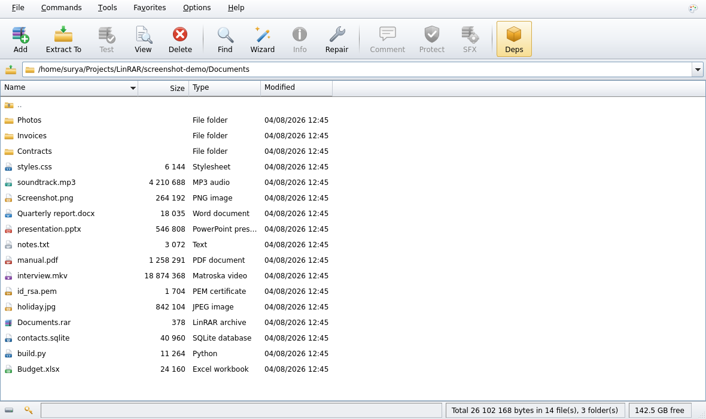
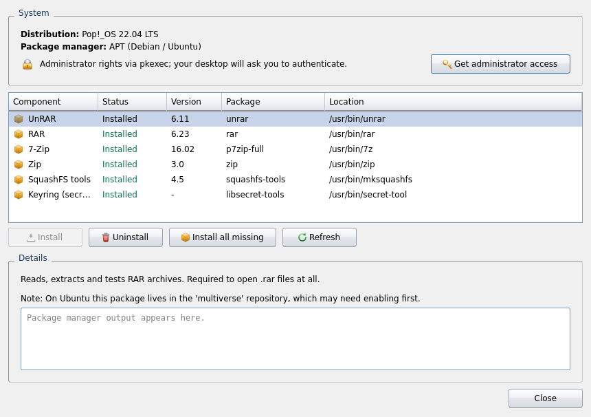
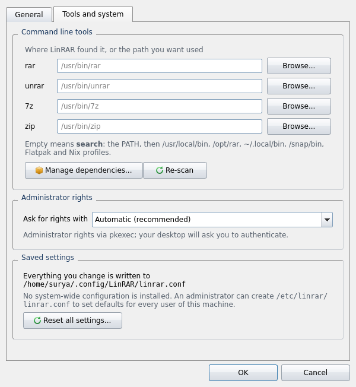
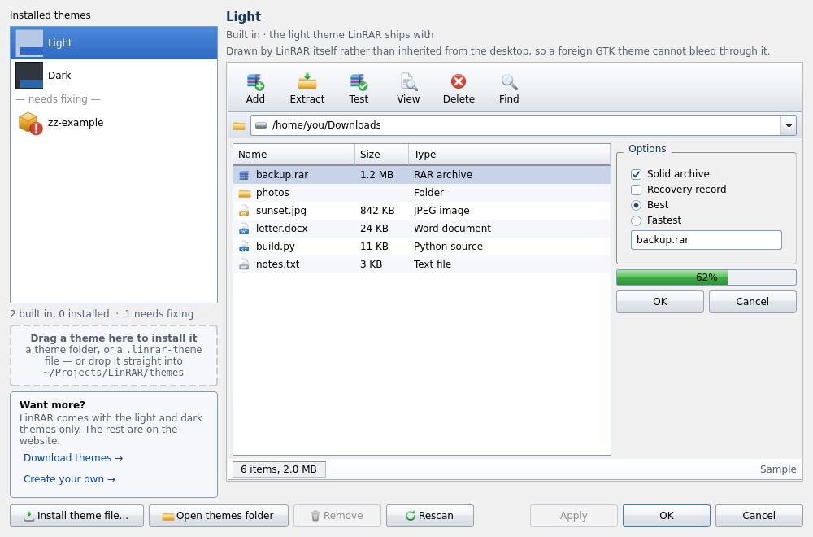
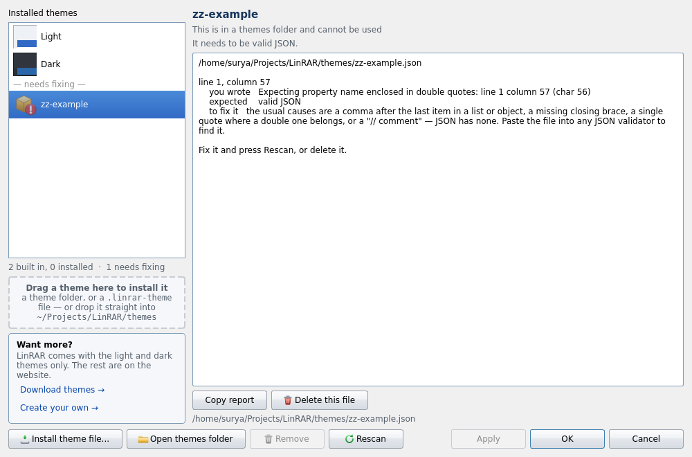
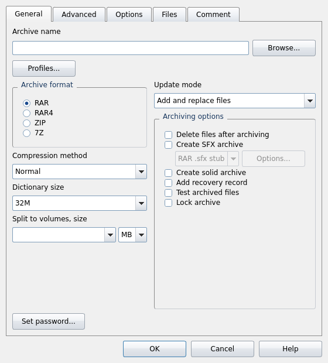
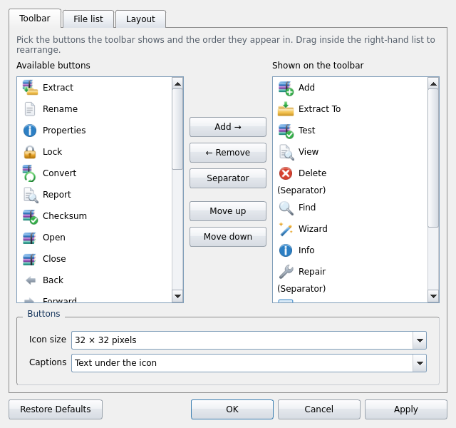

<div align="center">


# LinRAR

**A native WinRAR for Linux.**

Clone it, run one script, and you have the classic WinRAR interface: the same
dialogs, the same keyboard shortcuts, the same right-click menu, running
natively on your desktop.

**[linrar.vercel.app](https://linrar.vercel.app/)** &nbsp;|&nbsp;
[Source](https://github.com/suryanarayanrenjith/LinRAR) &nbsp;|&nbsp;
[Documentation](docs/USAGE.md)

[](https://github.com/suryanarayanrenjith/LinRAR/actions/workflows/tests.yml)
[](https://github.com/suryanarayanrenjith/LinRAR/actions/workflows/release.yml)
[](https://github.com/suryanarayanrenjith/LinRAR/releases/latest)
[](LICENSE)
[](#linux-only)
[](https://www.python.org/)
[](https://pypi.org/project/PyQt6/)

</div>

> [!IMPORTANT]
> **LinRAR is for Linux, and only for Linux. It does not run on Windows at
> all**, and it does not run on macOS or the BSDs either. This is not a
> limitation waiting to be lifted: see [Linux only](#linux-only) for what the
> program actually depends on. On Windows use WinRAR or 7-Zip; on macOS, Keka
> or The Unarchiver. Under WSL, install LinRAR *inside* the Linux
> distribution, never on the Windows side.

<table>
<tr>
<td width="50%"></td>
<td width="50%"></td>
</tr>
<tr>
<td align="center"><em>The light theme, drawn into LinRAR itself</em></td>
<td align="center"><em>Midnight Neon, one of ten you can download</em></td>
</tr>
</table>

RARLAB ships only command line binaries for Linux; there has never been a
native WinRAR GUI. LinRAR is that GUI, built with PyQt6 on top of `rar`,
`unrar`, `7z` and `zip`.

---

## Contents

- [Linux only](#linux-only): **read this first**
- [Architectures](#architectures)
- [Install](#install)
- [Setting up the tools](#setting-up-the-tools): **start here after installing**
- [What it does](#what-it-does)
- [Right-click menu and command line](#right-click-menu-and-command-line)
- [Requirements](#requirements)
- [Documentation](#documentation)
- [Links](#links)

---

## Linux only

LinRAR runs on **Linux and nothing else**. Every layer of it is tied to a Linux
desktop:

| It uses | Which means |
|---|---|
| the Linux builds of `rar`, `unrar`, `7z`, `zip` and `mksquashfs` | the work is done by ELF binaries invoked as child processes |
| the XDG base directories | settings live in `~/.config/LinRAR/`, defaults in `/etc/linrar/` |
| freedesktop.org desktop entries, MIME types and service menus | the application menu, file associations and the right-click entries in ten file managers |
| `pkexec`, `sudo` or `doas` | asking for administrator rights when a destination is not yours |
| AppImage and SquashFS | self-extracting archives, the Linux answer to WinRAR's `.exe` SFX |

On Windows and macOS every one of those is missing or means something else, so
LinRAR refuses at the door with an explanation rather than opening a window
that fails at the first archive. The check runs in three places, before
anything else happens: `install.sh`, `uninstall.sh`, and the application
itself, including `python -m linrar`, before PyQt6 is even imported.

```console
$ linrar
LinRAR for Linux does not run on Windows.

It drives the Linux builds of rar, unrar, 7z and zip, keeps its
settings in the XDG configuration directories, and registers itself
with a freedesktop.org desktop. None of that exists on Windows.
$ echo $?
1
```

### Architectures

**Any Linux your distribution builds Python and Qt for**, which in practice is
all of them: x86-64, ARM, RISC-V, POWER, s390x, LoongArch and the rest. LinRAR
itself is architecture-neutral, and `unrar`, `7z`, `zip` and `mksquashfs` are
open source and packaged everywhere.

Two things are not, and LinRAR says so plainly rather than failing oddly:

| | Published for | Elsewhere |
|---|---|---|
| **`rar`**, the only thing that can *write* a RAR archive: shareware, shipped as a binary by RARLAB | x86-64, x86, ARM64, ARM32 | Dependencies shows **Not available here** with the reason. Reading and extracting every format still works; only creating `.rar` needs it |
| **The AppImage runtime** used for self-extracting archives | x86-64, x86, ARM64, ARM32 | Building an AppImage refuses with an explanation and points at the **RAR `.sfx` stub**, which is a shell script and runs anywhere |

`install.sh` names the machine as it goes, warns once if `rar` has no build for
it, and records the architecture in the install receipt.

**Use instead:** WinRAR or 7-Zip on Windows; Keka or The Unarchiver on macOS;
the native 7-Zip or unrar port on the BSDs. **Under WSL**, install LinRAR
inside the Linux distribution. It works normally there, because WSL is a Linux
kernel; installing it on the Windows side does not work at all.

---

## Install

```bash
git clone https://github.com/suryanarayanrenjith/LinRAR.git
cd LinRAR
./install.sh
```

That is the whole setup. The installer creates the virtual environment,
installs the command line tools LinRAR drives (asking for your password once),
puts a `linrar` launcher on your `PATH`, installs the icon at nine sizes, adds
LinRAR to the application menu, registers it as the handler for archive files,
wires **Extract here / Extract to... / Add to archive...** into your file manager's
right-click menu, and finishes by starting the app once to prove it works.

```bash
linrar          # or pick LinRAR out of your application menu
```

| Command | What it does |
|---|---|
| `./install.sh` | install for the current user (default) |
| `./install.sh --system` | install for every user, in `/usr/local` |
| `./install.sh --no-deps` | set up the app only, skip the system packages |
| `./install.sh --reinstall` | install again over an existing install, or repair one |
| `./install.sh --status` | is it installed? what version, when, from where? |
| `./install.sh -y` | answer yes to everything |
| `./uninstall.sh` | remove all of it, `.venv` included |

**It installs once.** Run `./install.sh` a second time and it tells you what is
already there and stops, without touching a thing: `--reinstall` is how you
say you meant it. `./uninstall.sh` refuses just the same when there is nothing
installed to remove. Both keep a receipt (`.install-receipt`) so they know.

`uninstall.sh` reverses every file the installer wrote (launcher, desktop
entry, icons, MIME defaults, right-click entries and the virtual environment)
from a manifest it kept, and leaves the project folder for you to delete.

### Or install a released version

Every release is published as a tarball with a checksum beside it, if you would
rather have a fixed version than whatever `main` says today:

```bash
curl -LO https://github.com/suryanarayanrenjith/LinRAR/releases/latest/download/SHA256SUMS
curl -LO "https://github.com/suryanarayanrenjith/LinRAR/releases/latest/download/$(sed 's/.* //' SHA256SUMS)"
sha256sum -c SHA256SUMS          # must say: OK
tar xf linrar-*.tar.gz && cd linrar-*/ && ./install.sh
```

The tarball is the same tree a clone gives you, plus a stamp recording which
commit it was built from, so `linrar --version` can tell a published release
from a working copy that happens to carry the same number. Releases are
numbered by [Semantic Versioning](docs/VERSIONING.md) and each one publishes a
`latest.json` describing itself, which is what an update checker reads.

**Settings for every user.** `/etc/linrar/linrar.conf` (plus `conf.d`
drop-ins) sets defaults for everyone on the machine, and can *lock* the ones
that are not up for discussion: a locked setting is greyed out everywhere it
appears in the app, with a tooltip naming the file. `linrar --config-info`
prints what is in force and where each value came from. See
[Settings for every user](docs/USAGE.md#settings-for-every-user).

**Distributions.** APT, DNF/YUM, Pacman, Zypper, APK, XBPS, eopkg, Portage,
swupd, slackpkg, `rpm-ostree` (Silverblue, Kinoite, Bazzite) and NixOS are all
recognised, with fallbacks for when a PyQt6 wheel will not build, when `venv`
or `pip` is missing, and when a Wayland session has no Qt Wayland plugin.
[docs/INSTALL.md](docs/INSTALL.md) has the details and the troubleshooting.

---

## Setting up the tools

LinRAR is a **front end**. It draws the interface, decides what to do, and
hands the actual compression to the programs RARLAB and others ship for Linux.
Which of those you have installed decides what LinRAR can do, so this is the
first thing to look at after installing, and LinRAR gives you one place to
manage all of it.

`install.sh` already offers to install everything. The **Dependencies** manager
is where you check the result, add what you skipped, and fix anything your
distribution did not have.

### Opening it

The **Deps** button sits on the toolbar, called out in amber because it is the
one button a new user needs:

<div align="center">

</div>

It turns **red, with a warning badge**, whenever something required is missing,
and its tooltip names what. You will also find it under **Tools >
Dependencies**.

### What you are looking at

<div align="center">

</div>

The top panel reports what LinRAR worked out about your system: the
distribution, the package manager it will drive, and how it will ask for
administrator rights.

The table lists every component, where it was found, and which package provides
it **on your distribution**; package names differ, and LinRAR carries them for
each of the eighteen package managers it can drive, across 146 distributions.
Status reads:

| Status | Meaning |
|---|---|
| **Installed** (green) | found and working; the version and path are shown |
| **Missing** (red) | a required component; some things simply will not work |
| **Not installed** (amber) | optional; the features it powers are unavailable |
| **Not available here** (grey) | nobody publishes it for this architecture: see [Architectures](#architectures) |

Selecting a row explains what that component does, plus anything specific to
your distribution: that `rar` lives in *multiverse* on Ubuntu, in *RPM Fusion*
on Fedora, or in the AUR on Arch, for instance.

### The six components

| Component | Enables | Without it |
|---|---|---|
| **UnRAR** | reading, extracting and testing RAR archives | `.rar` files cannot be opened at all |
| **RAR** | creating and modifying RAR: compression, recovery records, locking, SFX | RAR archives are read-only |
| **7-Zip** | 7z, TAR, GZip, BZip2, XZ, ISO and CAB | those formats are unavailable |
| **Zip** | password-protected (AES) ZIP creation | plain ZIP still works; that is built in |
| **SquashFS tools** | building self-extracting AppImages | only the smaller RAR `.sfx` stub is available |
| **Keyring** (`secret-tool`) | saving passwords in your desktop keyring | passwords go to LinRAR's own file, obfuscated but **not encrypted** |

Only **UnRAR** and **RAR** are marked required. Everything else quietly widens
what LinRAR can do.

### Installing something

1. Press **Get administrator access**. Package changes need root, and LinRAR
   asks **once**: your desktop's authentication dialog appears (`pkexec`), or
   LinRAR asks for your password if only `sudo`/`doas` is available. The
   password goes straight to the helper and is never stored: a keep-alive
   keeps the authorisation for about fifteen minutes so the rest of your
   session just runs.
2. Select a component and press **Install**, or press **Install all missing**
   to do the lot in one command.
3. The package manager's own output streams into the **Details** pane, so a
   failure shows you exactly what it said rather than a shrug.
4. **Refresh** re-probes everything; LinRAR picks up new tools immediately, with
   no restart.

**Uninstall** removes a component the same way, warning you first when it is
one of the required ones.

### When a package is not available

`rar` is shareware and is not in every repository. If **Install** cannot find
it, install RARLAB's own build anywhere on your system and point LinRAR at it
in **Settings > Tools and system**:

<div align="center">

</div>

Each box shows, in grey, where LinRAR found that tool. Leave it empty and it
keeps searching for itself: your `PATH` first, then `/usr/local/bin`,
`/opt/rar`, `/opt/bin`, `~/.local/bin`, `~/bin`, `/snap/bin` and the Flatpak
and Nix profile directories, under every name these tools ship with (`7z`,
`7zz`, `7za`, `7zr`, `unrar`, `unrar-nonfree`, `unrar-free`), so an unusual
packaging choice is not a dead end. Type a path, or **Browse...**, to pin one
specific binary; **Re-scan** picks up anything you installed outside LinRAR
without restarting it.

The same tab chooses which escalation tool to use and shows where your settings
are kept.

---

## What it does

**Browsing**: browse the filesystem, step *into* an archive and keep browsing.
Folder tree, address bar, Back and Forward (`Alt+Left` / `Alt+Right`), sortable
columns, five view modes, column chooser, comment pane, favourites, recently
opened archives, find, drag and drop both ways. Stepping out of a folder
leaves the cursor on it, the tree keeps the branches you opened, `Ctrl+L` puts
a path straight into the address bar, and the status bar keeps an eye on the
free space where the files are going.

**Opening anything.** Archives are identified by their *contents*, so a file
opens whatever it is called: RAR, ZIP, 7z, TAR, GZip, BZip2, XZ, Zstandard,
ISO, CAB, and, through 7-Zip, `.deb`, `.rpm`, `.cpio`, `.wim`, `.msi`,
`.dmg`, `.squashfs`/`.snap`, `.lz`, `.lz4`, `.arj`, `.lzh`, `.Z` and ar
archives. When a file *cannot* be opened, LinRAR says exactly why: what it
found in the file, what its name claimed, which tool was needed and whether it
is installed, a hex dump of the first bytes, and what to do about it, with the
fix as a button. A later volume of a split archive opens the first one instead
of showing a confusing fragment.

**Archiving.** The full *Archive name and parameters* dialog: RAR5 / RAR4 /
ZIP / 7z, six compression presets, dictionary sizes, volumes, solid archives,
recovery records, locking, every update mode, encryption including encrypted
file names, exclusion masks, comments and saved profiles.

**Self-extracting archives, in one step.** Tick **Create SFX archive** in the
Add dialog and choose the kind right beside it: an **AppImage** (one
executable that unpacks itself on any Linux machine, the counterpart of
WinRAR's self-extracting `.exe`) or rar's smaller **`.sfx` stub**. **Options...**
opens the full SFX module: destination, commands to run before and after,
silent mode, overwrite policy, window title, icon, a licence to accept, and a
desktop menu entry. An existing archive is converted the same way from
**Commands > Convert archive to SFX**, which offers both formats in the same
dialog.

**Extraction**: the full *Extraction path and options* dialog, with WinRAR's
*Confirm file replace* prompt. Extracting never moves the browser; the window
stays where it is while the files land beside the archive. Extracting into a
folder you do not own asks for administrator rights and stages the files,
rather than running the archive tool as root.

**Progress**: two bars that mean two different things, as WinRAR's do: the
current file above, the whole job below, weighted by **bytes** rather than by
file count. With elapsed time, time left, bytes processed, the file count, the
speed, the live compression figure, and the percentage in the window title.

**Commands**: Test, View, Save as, Delete, Rename, Find, Info, Properties,
Comment, Protect (recovery record), recovery volumes and reconstruction,
Repair, Lock, Convert to SFX, batch Convert, reports, checksums. Every command
lives in exactly one menu, in WinRAR's arrangement: **Commands** for what is
done to an archive, **Tools** for what is done in bulk or to LinRAR itself.

**Find, by name or by what is inside** (`Ctrl+F`). A file-name mask filters
the list in place. Add some text and LinRAR reads the matching files, through
the current folder and everything under it, or through the whole of the open
archive, and lists every line that contains it, grouped by file, with line
numbers and a button that takes the window to any of them.

**Checksums** (`Ctrl+K`): CRC32, MD5, SHA-1, SHA-256 and SHA-512 for the
selected files, on disk or inside an archive, all from one pass over the
bytes. Paste a published checksum and it names the file that matches it; the
result saves in the exact `sha256sum` layout.

**Saved passwords that are actually used.** *Tools > Organize passwords* holds
passwords against file-name masks, and an archive that one of them opens never
asks. The prompt itself has a **Remember this password** box.

**Drag files out**, into any file manager, including out of an open archive,
which unpacks them on the way and keeps a selected folder whole.

**Themes.** Light and dark are drawn into LinRAR itself; **ten more are a
download away**, and any number of your own after that. A theme is not a tint:
it restyles every surface, edge and gradient, sets the corner radii and the font,
and redraws all thirty-nine icons in its own colours and one of four styles.

One button opens the lot: the palette in the menu bar's corner, **Options >
Themes...**, or `Ctrl+Shift+M`. Every theme is previewed as a **working
miniature of the window** before you apply it, **dragging a file onto that window
installs it**, and one that will not load is listed with the line to fix and the
JSON to paste instead, rather than quietly not appearing.

- **[linrar.vercel.app/themes](https://linrar.vercel.app/themes)**: ten to
  download, previewed in full.
- **[linrar.vercel.app/create](https://linrar.vercel.app/create)**: the builder.
  Pick a dozen colours and it derives the other eighty, draws the icon set, warns
  you about anything unreadable, and hands you the file.

**Customization.** A toolbar you choose the contents and order of from 38
commands, five file-list views, and a layout you can rearrange. Everything is
remembered between launches.

<table>
<tr>
<td width="58%" valign="top"></td>
<td width="42%" valign="top"></td>
</tr>
<tr>
<td align="center" valign="top"><em>Themes: every one previewed as a working miniature of the window</em></td>
<td align="center" valign="top"><em>A theme that will not load says which line, and what to write instead</em></td>
</tr>
</table>

<table>
<tr>
<td width="46%" valign="top"></td>
<td width="54%" valign="top"></td>
</tr>
<tr>
<td align="center" valign="top"><em>Archive name and parameters</em></td>
<td align="center" valign="top"><em>Customize: toolbar, file list, layout</em></td>
</tr>
</table>

Full tour and keyboard shortcuts: [docs/USAGE.md](docs/USAGE.md).

---

## Right-click menu and command line

After installing, archives get LinRAR entries in **Dolphin, Konqueror, Nemo,
Nautilus, Caja, Thunar, PCManFM, PCManFM-Qt, SpaceFM, Pantheon Files, Deepin's
file manager and Krusader**: ten families through six different formats, all
of them written by `install.sh` and all reversed by `uninstall.sh`. They call
the same command line, which you can use directly.
**Every action has a short form as well as the long one**; the long forms are
what the desktop files use, the short ones are for typing.

```
LinRAR for Linux: a WinRAR-style archive manager.

Usage:
  linrar [FILE|FOLDER]              open an archive, or browse a folder
  linrar -x, --extract-here FILE... unpack each archive beside itself
  linrar -X, --extract-to   FILE... unpack, asking where and how
  linrar -a, --add          FILE... add the files to a new archive
  linrar -t, --test         FILE... check each archive for damage
  linrar -i, --inspect      FILE... report what a file really is, and print it
  linrar -c, --config-info          show where every setting comes from
  linrar -V, --version | -h, --help
```

| Short | Long | What it does |
|:--|:--|:--|
| | `linrar FILE\|FOLDER` | open an archive, or browse a folder |
| `-x` | `--extract-here` | unpack each archive beside itself |
| `-X` | `--extract-to` | unpack, asking where and how |
| `-a` | `--add` | add the files to a new archive |
| `-t` | `--test` | check each archive for damage |
| `-i` | `--inspect` | report what a file really is, and print it |
| `-c` | `--config-info` | show where every setting comes from |
| `-V` | `--version` | print the version |
| `-h` | `--help` | print the usage above |

```bash
linrar ~/Downloads             # browse a folder
linrar backup.rar              # open an archive
linrar -x a.rar b.zip          # unpack each one beside itself
linrar -X a.rar                # unpack, asking where and how
linrar -a *.txt                # add the files to a new archive
linrar -t a.rar                # check for damage
linrar -i mystery.rar          # what is this file, really?
linrar -c                      # where every setting comes from
linrar -- -odd-name.rar        # -- ends the options, for names starting with -
```

The command line is parsed rather than sniffed. An unknown option is an error
that suggests the one you meant, an action with nothing to act on fails before
a window opens, and both exit **2**; a file that could not be opened exits
**1**. Short options are never bundled: write `-x -t`, not `-xt`.

**`--inspect` is the troubleshooting tool.** When something will not open, it
prints the same report the application shows: what the file actually is, its
size and permissions, the format its contents prove (not the one its name
claims), the tool needed to read it and whether that tool is installed, a hex
dump of the first bytes, and what to do next. It exits 0 only for a file LinRAR
can really open, so it works in a script:

```console
$ linrar -i download.rar
"download.rar" is not an archive LinRAR can open.

LinRAR read the start of the file and it is an HTML document. The name ends in
".rar", but the contents do not match, so the file has been renamed, is a
different kind of file altogether, or was damaged in transit.
...
```

---

## Requirements

**Linux: see [Linux only](#linux-only).** There is no Windows build, no macOS
build, and no plan for either. The installer, the uninstaller and the
application each check before doing anything and stop with an explanation
anywhere else.

| Component | Purpose | Required |
|---|---|---|
| Python 3.9+ and PyQt6 | the application itself | yes, the installer handles it |
| `unrar` | read, extract and test RAR archives | yes |
| `rar` | create and modify RAR archives | to write RAR |
| `7z` | 7z, TAR, GZip, BZip2, XZ, ISO, CAB | optional |
| `zip` | password-protected ZIP creation | optional |
| `squashfs-tools` | building self-extracting AppImages | for SFX |
| `secret-tool` | keyring storage for saved passwords | recommended |

None of them need installing by hand: see
[Setting up the tools](#setting-up-the-tools). Plain ZIP reading and writing
needs nothing at all: it is handled in-process by Python.

---

## Documentation

| Document | Covers |
|---|---|
| [docs/INSTALL.md](docs/INSTALL.md) | installing, distributions, file-manager integration, troubleshooting |
| [docs/USAGE.md](docs/USAGE.md) | everything the app does, shortcuts, customization, command line |
| [docs/THEMES.md](docs/THEMES.md) | where themes live, and the format, if you want to write one by hand |
| [docs/ARCHITECTURE.md](docs/ARCHITECTURE.md) | how it works inside, and the traps worth knowing about |
| [docs/DEVELOPMENT.md](docs/DEVELOPMENT.md) | running from source, the test suite, project layout |
| [CHANGELOG.md](CHANGELOG.md) | what changed |

---

## Links

| | |
|---|---|
| **Website** | [linrar.vercel.app](https://linrar.vercel.app/) |
| **Source code and issues** | [github.com/suryanarayanrenjith/LinRAR](https://github.com/suryanarayanrenjith/LinRAR) |
| **Author** | Surya ([surya.is-a.dev](https://surya.is-a.dev/)) |

All three are in the application too, under **Help > About LinRAR**.

---

## Credits

UI built by **Surya**: [surya.is-a.dev](https://surya.is-a.dev/)

LinRAR's own code is MIT licensed ([LICENSE](LICENSE)). It contains no RAR
code: RAR and UnRAR are Copyright © Alexander Roshal, LinRAR simply drives
them, and it is not affiliated with win.rar GmbH.
