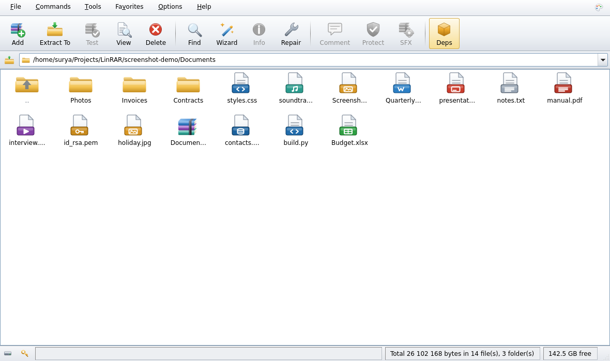

# Using LinRAR

- [Browsing](#browsing)
- [Opening files that are not archives](#opening-files-that-are-not-archives)
- [When something will not open](#when-something-will-not-open)
- [Creating archives](#creating-archives)
- [Extracting](#extracting)
- [Protecting and repairing](#protecting-and-repairing)
- [Self-extracting archives](#self-extracting-archives)
- [Themes and customization](#themes-and-customization)
- [Finding things](#finding-things)
- [Checksums](#checksums)
- [Passwords](#passwords)
- [Dragging files](#dragging-files)
- [Right-click menu and command line](#right-click-menu-and-command-line)
- [Keyboard shortcuts](#keyboard-shortcuts)
- [Keeping LinRAR up to date](#keeping-linrar-up-to-date)
- [Where your settings live](#where-your-settings-live)

## Browsing

LinRAR opens as a file manager. Double-click an archive to step *inside* it and
the window becomes an archive browser; the `..` row steps back out. The folder
tree on the left follows whichever of the two you are looking at.

**Getting around.** `Alt+←` and `Alt+→` are Back and Forward, over folders and
archives alike, and their tooltips name where they lead. `Backspace` goes up,
`Ctrl+L` puts the cursor in the address bar so you can type a path (`~`, `$HOME`
and relative paths all work), `Ctrl+G` opens a folder chooser, and `F5` re-lists
the folder and clears any find filter.

Three small things that make it feel like a file manager rather than a dialog:
stepping out of a folder leaves the cursor **on** that folder; coming back to a
folder puts the cursor back where it was; and the folder tree keeps every
branch you opened, because it is revealed rather than rebuilt.

Five views, from **Options → File list** or `Ctrl+1`…`Ctrl+5`: Details, List,
Small icons, Large icons, Tiles. Click a column header to sort — the choice is
remembered, as are the column widths and which columns are shown.

## Opening files that are not archives

Every file in the list is identified: the **Type** column names it and the icon
draws it — Word, Excel and PowerPoint documents, PDFs, images, audio, video,
source code, fonts, programs, databases, disc images and keys each have their
own. A file with no extension at all is identified from its first bytes, so a
compiled program says so rather than reading as "File". Selecting one names it
in the status bar.

**Double-clicking** a file that is not an archive hands it to whatever your
desktop opens it with. **View** (`Ctrl+V`, or double-clicking a member inside
an archive) opens LinRAR's own viewer, which shows the file rather than its
bytes:

| What it is | What you see |
|---|---|
| Text, source, JSON, XML, CSV, logs | the text, in whatever encoding it turns out to be |
| PNG, JPEG, GIF, BMP, WebP and friends | the image, scaled to fit |
| **Word, PowerPoint, Excel** (`.docx`, `.pptx`, `.xlsx`) | the document's **text** — paragraphs, slides, and cells as rows |
| **OpenDocument and EPUB** (`.odt`, `.ods`, `.odp`, `.epub`) | the same |
| PDF | LinRAR does not render pages; **Open with...** hands it to your reader |
| An archive | an offer to **Open in LinRAR** |
| Anything else | its bytes as a hex dump, with the file *named* above it and **Open with...** beside it |

**View as hex** switches to the raw bytes at any point, and **Save a copy...**
writes the file out — useful for a member of an archive you only wanted one
file from.

Documents are shown as plain text: no formatting, no images, no layout. It is
a preview, and **Open with...** is one button away when you want the real
thing.

### Documents that are secretly archives

`.docx`, `.xlsx`, `.pptx`, `.odt`, `.epub` and their relations are ZIP archives
— genuinely, byte for byte. LinRAR can open them as archives, and does when you
ask:

- **double-click** opens the document in the application that owns it;
- **right-click → Open as archive** opens the ZIP, so you can pull an image out
  of a slide deck or look at the XML.

Installing LinRAR does not make it the handler for these, or for `.jar`,
`.apk`, `.deb`, `.rpm` or `.epub`. It offers itself for all of them — they
appear in "Open with" — and takes over only the formats whose whole purpose is
to be unpacked.

## When something will not open

Archives are recognised by their **contents**, not their names, so a file opens
whatever it is called — and a `.rar` that is really an HTML error page is
reported as one rather than as a broken archive.

When a file cannot be opened, LinRAR does not shrug. It shows what it found:

- what the file is — regular file, folder, device, dangling link — its size,
  when it changed, and whether it can be read at all;
- what its contents say it is (plain text, a PDF, an ELF binary, an image…)
  next to what its name claimed;
- which tool is needed to read that format, and whether it is installed;
- whether it is a later part of a split archive, and where the first part is;
- a hex dump of the first bytes, the tool's exit code and its own words, all
  under **Show details** and on **Copy report** for a bug report.

Below that are the things you can do about it, as buttons: *Install tools…*
when a tool is missing, *Open volume 1* for a split set, *View in LinRAR*,
*Open with another application*, *Repair…*, or somewhere else to go when a
folder has vanished. Double-clicking an ordinary file hands it to the desktop;
if nothing takes it, that is explained too rather than silently doing nothing.

The same report is available from the terminal with `linrar -i FILE`.

**Formats.** RAR5, RAR4, ZIP, 7z, TAR, GZip, BZip2, XZ, Zstandard, ISO and CAB,
plus — wherever 7-Zip is installed — `.deb`, `.rpm`, `.cpio`, `.ar`/`.a`,
`.wim`, `.msi`, `.dmg`, `.squashfs`/`.snap`, `.lzma`, `.lz`, `.lz4`, `.arj`,
`.lzh` and `.Z`. Everything past ZIP, RAR and 7z is read-only.

<table>
<tr>
<td width="50%" valign="top"></td>
<td width="50%" valign="top"></td>
</tr>
<tr>
<td align="center"><em>Inside an archive, Details view</em></td>
<td align="center"><em>The same folder, Large icons</em></td>
</tr>
</table>

## Creating archives

Select files and press **Add** (`Alt+A`).

- **Format** — RAR5, RAR4, ZIP or 7z. Options that only apply to one format
  grey out on their own.
- **Compression** — Store, Fastest, Fast, Normal, Good, Best, with the
  dictionary sizes each supports.
- **Split to volumes** — a plain number uses the unit beside it, or write the
  unit in the box (`700 MB`). The classic media sizes are presets.
- **Archiving options** — delete after archiving, self-extracting, solid,
  recovery record, test after, lock.
- **Create SFX archive** — tick the box and pick the kind from the list beside
  it: **AppImage** or **RAR .sfx stub**. **Options…** opens the full SFX
  module. The archive name follows your choice (`.AppImage` or `.sfx`), and
  an AppImage greys out volume splitting because it is a single file. See
  [Self-extracting archives](#self-extracting-archives).
- **Profiles** — save the whole set of choices under a name and reuse it. Six
  come built in.
- **Options tab** — include subfolders, store full paths, exclusion masks.
- **Comment tab** — text stored inside the archive.

Whatever you used last time is what the dialog opens with next time.

## Extracting

**Extract To** (`Alt+E`) opens the full dialog: destination with a folder tree
and history, update mode, overwrite mode, extract to subfolders, keep broken
files, and full-paths / no-paths. **Alt+W** unpacks straight into the current
folder.

With *Ask before overwrite* — the default — conflicts are collected before any
work starts and shown in one prompt with **Yes / Yes to All / No / No to All /
Rename**.

**Extracting never moves you.** Unpacking an archive from the file list, from
the right-click menu or from the command line leaves the browser exactly where
it is: LinRAR reads the archive, shows the progress window, and puts the files
beside it — it does not open the archive in the background first. The listing
refreshes when it is done, so the new files appear where you are looking.

### The progress window

Two bars, as in WinRAR, and they do not move together:

- **Current file** — how far through the file named above it.
- **Total** — how far through the whole job, **weighted by bytes**. Thirty
  small files followed by one large one is not "almost done" after the small
  ones, and the bar says so.

Beside them: elapsed time, time left, bytes processed of the total, the file
count (`14 of 38`), the current speed, and — while an archive is being
written — how far it has been compressed. The percentage is in the window
title, so the taskbar carries it when the window is behind something else.
**Background** hands the job off and reports when it finishes; **Cancel**
stops it.

Extracting into a folder you do not own is not refused: LinRAR asks for
administrator rights, unpacks into a private staging folder, and moves the
result into place as root, so the archive tool itself never runs privileged.

## Protecting and repairing

- **Protect** (`Alt+P`) adds a recovery record, with an adjustable redundancy
  percentage, so a damaged archive can be repaired later.
- **Add recovery volumes** creates `.rev` files that can rebuild a *missing*
  part of a volume set; **Reconstruct missing volumes** uses them.
- **Repair** (`Alt+R`) rebuilds a damaged archive.
- **Lock** marks an archive so LinRAR refuses to modify it.
- **Test** (`Alt+T`) verifies without writing anything.

## Self-extracting archives

WinRAR's *Convert to SFX* makes a Windows `.exe`. Linux has two answers, and
LinRAR offers both wherever a self-extracting archive can be made:

| | Best for | Needs |
|---|---|---|
| **AppImage** | giving the archive to somebody with nothing installed | `squashfs-tools`, and a ~1 MB runtime fetched once |
| **RAR `.sfx` stub** | the smallest possible result, on a machine with a shell | nothing |

**Making one while archiving.** In the *Archive name and parameters* dialog,
tick **Create SFX archive** and pick the kind from the list beside it. The
archive name follows the choice, **Options…** opens the AppImage settings, and
one press of OK compresses *and* wraps — there is no intermediate `.rar` to
tidy up afterwards.

**Converting one that already exists.** **Commands → Convert archive to SFX**
(`Alt+S`) asks which of the two you want, and explains the difference.

Only the AppImage has anything to configure — destination, licence, icon, what
runs afterwards — so it is the only one with an options window. The `.sfx` stub
is a small shell script that takes no options at all, and choosing it goes
straight to building the file.

```bash
./MyArchive.AppImage                    # GUI: license → destination → extract
./MyArchive.AppImage --list             # list contents
./MyArchive.AppImage --test             # verify integrity
./MyArchive.AppImage -d ~/here --silent # unattended
```

The SFX dialog mirrors WinRAR's SFX module: default destination, commands to
run before and after, silent mode, overwrite policy, window title and
description, a custom icon, a licence the user must accept, and a `.desktop`
menu entry created after extraction. Encrypted payloads prompt for the password
(via `zenity` or the terminal). Those pages describe the AppImage; the `.sfx`
stub takes no configuration, so choosing it puts them out of the way.

An AppImage is a single file, so *Split to volumes* is greyed out while it is
selected.

## Themes and customization

**Theme** — light or dark, drawn by LinRAR rather than inherited from the
desktop, with a matching build of the icon set. **Options → Theme**, the switch
in the menu bar's corner, or `Ctrl+Shift+T`.

**Options → Customize** (`Ctrl+U`) has three tabs:

- **Toolbar** — pick from 34 commands, drag them into any order, insert
  separators, choose the icon size (16/24/32/48) and whether captions sit under
  the icon, beside it, or not at all.
- **File list** — the five views, row height, row separators, alternating
  shading, and which columns Details shows.
- **Layout** — toolbar at the top or bottom, address bar and status bar on or
  off, folder tree on the left or right, comment pane above or below.

**Options → Layout → Reset the interface** puts all of it back.

## Finding things

`Ctrl+F` asks for two things, and what you fill in decides what happens.

A **file name mask** on its own filters the list in place — `*.log`, `report*`
— in the current folder or in the open archive. `F5` clears it.

Add some **text** and LinRAR reads the files themselves: through the current
folder and everything under it (or the whole of the open archive) and lists
every line that contains it, grouped by file, with the line numbers.
**Go to file** takes the window to whichever one you pick. Only files whose
name passes the mask are read, so `*.py` plus `import` searches your source
and not your photographs. An archive is unpacked once for the search and the
scratch folder is removed afterwards.

## Checksums

`Ctrl+K`, or **Tools → Calculate checksums**, works out CRC32, MD5, SHA-1,
SHA-256 and SHA-512 for whatever is selected — files on disk, or members of an
open archive, which are unpacked first. All five come from one pass over the
bytes, so asking for them all costs no more than asking for one.

Paste a published checksum into the box at the bottom (a bare digest, or a
whole `sha256sum` line) and it names the file that matches and which algorithm
it was. The result copies or saves either as a table of everything, or in the
exact `sha256sum` layout so it can be fed to `sha256sum -c`.

## Passwords

Set one for a single operation from the dialog that needs it, or a default for
the session with `Ctrl+P`. Tick **Remember this password** on the prompt and
it is saved for next time.

**Tools → Organize passwords** manages them. Each carries a file-name mask —
`backup*.rar`, or `*` for any archive — and when an archive asks for a
password LinRAR tries every saved one whose mask fits, most specific first,
before it asks you. The status bar says when one was used.

They go to your desktop's keyring through `secret-tool` when it is installed.
Without a keyring they are kept in LinRAR's own file, obfuscated but **not
encrypted**, and the dialog says exactly that.

Passwords are handed to `rar`/`unrar` on standard input, never on the command
line, so they never appear in the process list.

## Dragging files

Files can be dragged out of the list into any file manager, including out of
an **open archive** — they are unpacked on the way, and a selected folder
arrives as a folder. Very large selections are refused with a pointer to
Extract, which has a progress window and a Cancel.

Dragging files *into* LinRAR opens a folder, opens an archive, or starts a new
one, depending on what you dropped.

## Right-click menu and command line

After installing, archives get LinRAR entries in Dolphin, Nemo, Nautilus, Caja
and Thunar. They all call the same command line, which you can use yourself.
Every action has a short form as well as the long one the desktop files use:

```
Usage:
  linrar [FILE|FOLDER]              open an archive, or browse a folder
  linrar -x, --extract-here FILE... unpack each archive beside itself
  linrar -X, --extract-to   FILE... unpack, asking where and how
  linrar -a, --add          FILE... add the files to a new archive
  linrar -t, --test         FILE... check each archive for damage
  linrar -i, --inspect      FILE... report what a file really is, and print it
  linrar -c, --config-info          show where every setting comes from
  linrar -V, --version | -h, --help
```

```bash
linrar                         # browse your home folder
linrar ~/Downloads             # browse a folder
linrar backup.rar              # open an archive
linrar -x a.rar b.zip          # unpack each one beside itself
linrar -X a.rar                # unpack, asking where and how
linrar -a *.txt                # add the files to a new archive
linrar -t a.rar                # check for damage
linrar -i mystery.rar          # what is this file, really?
linrar -c                      # where every setting comes from
linrar -- -odd-name.rar        # -- ends the options
```

Short options are not bundled: write `-x -t`, never `-xt`. An unknown option is
an error that suggests the one you meant, and an action with nothing to act on
fails before a window opens; both exit **2**. `--inspect` exits **1** for a file
LinRAR cannot open, and **0** for one it can, so it can be used in a script.

LinRAR runs on Linux only; on any other system it prints why and exits without
opening a window, with status **1**.

## Keyboard shortcuts

| | |
|---|---|
| `Alt+A` | add to archive |
| `Alt+E` / `Alt+W` | extract to… / extract here |
| `Alt+T` | test |
| `Alt+V` | view file |
| `Alt+I` | archive information |
| `Alt+R` | repair |
| `Alt+P` | add recovery record |
| `Alt+S` | convert archive to SFX (AppImage or .sfx stub) |
| `Alt+Q` | convert archives |
| `Alt+G` | generate report |
| `Ctrl+K` | calculate checksums |
| `Del` / `F2` / `F7` | delete / rename / new folder |
| `Ctrl+O` / `Ctrl+W` | open / close archive |
| `Alt+←` / `Alt+→` | back / forward |
| `Backspace` / `F5` | up one level / refresh and clear the filter |
| `Ctrl+L` / `Ctrl+G` | address bar / go to folder |
| `Ctrl+F` | find |
| `Ctrl+A`, `+`, `-`, `*` | select all, select / deselect / invert by mask |
| `Ctrl+C` `Ctrl+X` `Ctrl+V` | copy, cut, paste |
| `Ctrl+Shift+C` | copy path |
| `Alt+Enter` | properties |
| `Ctrl+1`…`Ctrl+5` | Details, List, Small icons, Large icons, Tiles |
| `Ctrl+T` / `Ctrl+H` | folder tree / hidden files |
| `Ctrl+U` | customize |
| `Ctrl+Shift+T` | switch theme |
| `Ctrl+P` / `Ctrl+S` / `Ctrl+D` | default password / settings / add to favourites |
| `F1` / `Shift+F1` | help / keyboard shortcuts |
| `Ctrl+Q` | quit |

## Keeping LinRAR up to date

**Help → Check for updates…** asks whether a newer version has been released.
Nothing is sent anywhere: it fetches one small file describing the newest
release and compares the version with yours.

If there is one, you are shown what it is, when it was published, how big the
download is and what changed, and then you decide. **Update now** takes it
through seven stages, each ticked off as it passes:

| Stage | What happens |
|---|---|
| Checking for updates | asks what the newest release is |
| Downloading | fetches the release tarball, with a byte count, speed and time left |
| Verifying | re-reads the file from disk and checks its SHA-256 against the one the release published |
| Unpacking | opens the archive, refusing anything that tries to write outside its own folder |
| Backing up | copies your current version aside, so every step after this is reversible |
| Installing | writes the new files, **deletes the ones the new release no longer ships**, refreshes the launcher, desktop entry and icons |
| Finished | starts the new version in a fresh process, confirms it reports the new version, then removes the backup and empties the download cache |

**Show details** opens a log of everything it did, and **Copy log** puts it on
the clipboard — that is what to attach to a bug report if an update goes wrong.

**Nothing is left behind.** Every release carries a list of the files it
installs, so an update knows exactly what the version it is replacing put on
disk. Files the new release no longer ships are deleted, folders it dropped go
with them, stale compiled bytecode is cleared, and when it is over the backup
and the download are removed too — the project folder holds the new version and
nothing else. Files *you* keep in the folder are never touched: they are not on
any release's list, and the updater only removes what it recognises as its own.

**If anything fails, the update is undone.** The backup goes back, and you are
left with the version that was working, with the reason on screen. That
includes the last two checks: an update that installs perfectly but will not
start, or that leaves a file of the old version behind, is rolled back too.
There is a free-space check before anything is downloaded, so a full disk stops
the update rather than interrupting it half way.

LinRAR is not restarted for you. When the update is in, it offers **Restart
LinRAR**; until you take it, the copy you are using is still the old one — and
LinRAR says so rather than pretending otherwise. While a restart is pending,
the About box, **Settings → Updates** and the status bar all read something
like *"2.0.0 — 2.1.0 is installed, restart to use it"*, and checking for
updates again will not re-offer the release you have just installed.

### Automatic updates

**Options → Settings → General → Updates**, all off until you turn them on:

| Setting | What it does |
|---|---|
| **Check for updates when LinRAR starts** | a quiet check a couple of seconds after the window opens. Nothing appears unless there is an update; if the server cannot be reached, nothing appears at all |
| **Download and install them automatically** | when a check finds one, it is installed without being asked first. The window still appears and still shows every stage — "automatic" means without being asked, not without being told |
| **Include pre-release versions** | offers `2.1.0-rc.1` and friends. Off by default: a pre-release ranks below the release it leads to and is never offered by accident |

A start-up check goes to the network at most once an hour, however many times
you open LinRAR in between — opening an archive from your file manager should
not mean an HTTP request every time.

**Skip this version** puts a single version aside; it is never offered again,
and the next one after it is.

### When it will not update itself

LinRAR refuses to overwrite a copy that is not its to overwrite, and says which
of these it is:

- **A source checkout.** A clone carries a version number, but nobody published
  it — update it with `git pull`.
- **A folder it cannot write to**, which usually means a distribution package.
  Update it the way the rest of the system is updated.
- **A system-wide install** (`./install.sh --system`) on a session with no way
  to become an administrator. The command to run by hand is shown.

Administrators can settle the question for a whole machine by locking the
`update/` keys — see [Settings for every user](#settings-for-every-user).

## Where your settings live

One readable file:

```
~/.config/LinRAR/linrar.conf
```

It holds the theme, toolbar contents and style, view mode, row height, sort
order, layout, window and splitter geometry, column widths, the compression
settings of the last archive you made, the extraction options you last used,
the find mask, favourites, folder history, saved profiles and password
metadata. **Settings → Tools and system → Reset all settings** clears it.

## Settings for every user

An administrator can set defaults for everyone on the machine, and lock the
ones that are not up for discussion. LinRAR reads these files in order, each
one overriding the one before:

```
/etc/xdg/LinRAR/linrar.conf      any $XDG_CONFIG_DIRS entry
/etc/linrar/linrar.conf          the machine's own settings
/etc/linrar/conf.d/*.conf        drop-ins, in name order
~/.config/LinRAR/linrar.conf     each user's own choices — last word
```

`./install.sh --system` writes `/etc/linrar/linrar.conf` with every setting
commented out; `--global-config` adds it to a user install, and
`./install.sh --print-global-config` prints it to redirect wherever you like.
It is never overwritten once it exists.

The format is the same INI the user's file uses. **Comments start with a
semicolon** — a `#` is an ordinary character to the parser, so `#theme=light`
would be read as a setting named `#theme` (LinRAR ignores keys like that, but
your setting would silently not apply):

```ini
[view]
theme=dark
show_tree=true

[compression]
method=5

[paths]
rar=/opt/rar/rar

[policy]
locked=view/theme, paths/*
```

Everything outside `[policy]` is a **default**: the user can still change it,
and their choice wins. `locked` makes a key the administrator's: LinRAR keeps
the value set here, ignores whatever is in the user's file, greys the control
out wherever it appears — menu entry, Settings dialog, Customize dialog — with
a tooltip naming the file, and leaves the key alone when the user saves. A key
is its section and name joined by a slash, shell wildcards work, and
`lock_all=true` locks every key the file sets without naming them twice.

Window geometry (`geometry/*`) and the config version stamp (`meta/*`) cannot
be set or locked from a system file. They are not preferences, and freezing
them would break the window rather than manage it.

To see what any of it actually resolves to:

```bash
linrar --config-info
```

It lists the files in play, the locked keys, every effective value, and whether
each came from the user, the system, or the built-in default. **Settings →
Tools and system** shows the same thing in the application, under *Saved
settings*.
