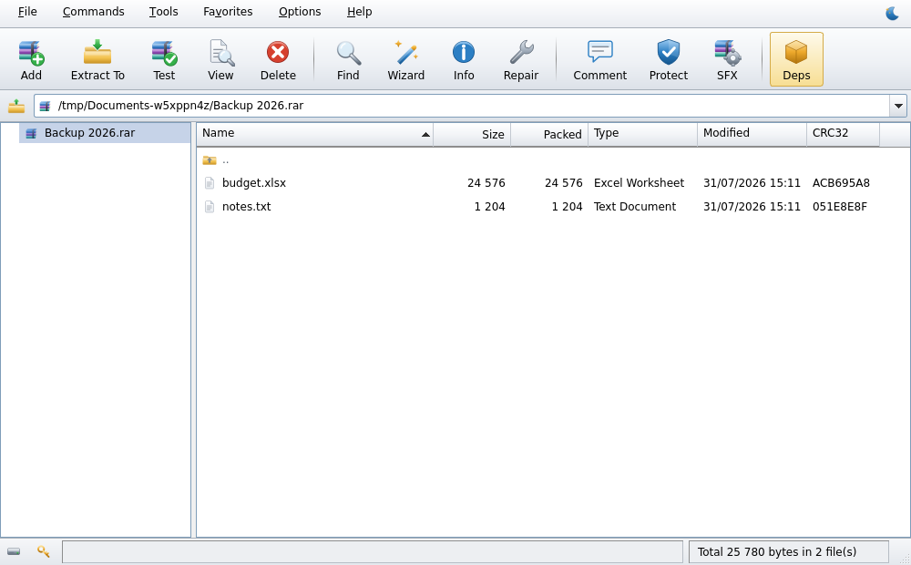

# Using LinRAR

- [Browsing](#browsing)
- [Creating archives](#creating-archives)
- [Extracting](#extracting)
- [Protecting and repairing](#protecting-and-repairing)
- [Self-extracting AppImages](#self-extracting-appimages)
- [Themes and customization](#themes-and-customization)
- [Passwords](#passwords)
- [Right-click menu and command line](#right-click-menu-and-command-line)
- [Keyboard shortcuts](#keyboard-shortcuts)
- [Where your settings live](#where-your-settings-live)

## Browsing

LinRAR opens as a file manager. Double-click an archive to step *inside* it and
the window becomes an archive browser; the `..` row steps back out. The folder
tree on the left follows whichever of the two you are looking at.

Five views, from **Options → File list** or `Ctrl+1`…`Ctrl+5`: Details, List,
Small icons, Large icons, Tiles. Click a column header to sort — the choice is
remembered, as are the column widths and which columns are shown.

<div align="center">

</div>

## Creating archives

Select files and press **Add** (`Alt+A`).

- **Format** — RAR5, RAR4, ZIP or 7z. Options that only apply to one format
  grey out on their own.
- **Compression** — Store, Fastest, Fast, Normal, Good, Best, with the
  dictionary sizes each supports.
- **Split to volumes** — a plain number uses the unit beside it, or write the
  unit in the box (`700 MB`). The classic media sizes are presets.
- **Archiving options** — delete after archiving, SFX, solid, recovery record,
  test after, lock.
- **Profiles** — save the whole set of choices under a name and reuse it. Six
  come built in.
- **Options tab** — include subfolders, store full paths, exclusion masks.
- **Comment tab** — text stored inside the archive.

Whatever you used last time is what the dialog opens with next time.

## Extracting

**Extract To** (`Alt+E`) opens the full dialog: destination with a folder tree
and history, update mode, overwrite mode, extract to subfolders, keep broken
files, and full-paths / no-paths. **Alt+W** unpacks straight into the current
folder.

With *Ask before overwrite* — the default — conflicts are collected before any
work starts and shown in one prompt with **Yes / Yes to All / No / No to All /
Rename**.

Extracting into a folder you do not own is not refused: LinRAR asks for
administrator rights, unpacks into a private staging folder, and moves the
result into place as root, so the archive tool itself never runs privileged.

## Protecting and repairing

- **Protect** (`Alt+P`) adds a recovery record, with an adjustable redundancy
  percentage, so a damaged archive can be repaired later.
- **Add recovery volumes** creates `.rev` files that can rebuild a *missing*
  part of a volume set; **Reconstruct missing volumes** uses them.
- **Repair** (`Alt+R`) rebuilds a damaged archive.
- **Lock** marks an archive so LinRAR refuses to modify it.
- **Test** (`Alt+T`) verifies without writing anything.

## Self-extracting AppImages

WinRAR's *Convert to SFX* makes a Windows `.exe`. The Linux equivalent of a
single double-clickable file is the **AppImage**, so that is what LinRAR builds
(**Commands → Convert to AppImage**, `Alt+S`). The result needs nothing
installed on the target machine — the extractor is bundled inside it.

```bash
./MyArchive.AppImage                    # GUI: license → destination → extract
./MyArchive.AppImage --list             # list contents
./MyArchive.AppImage --test             # verify integrity
./MyArchive.AppImage -d ~/here --silent # unattended
```

The **Advanced SFX options** dialog mirrors WinRAR's SFX module: default
destination, commands to run before and after, silent mode, overwrite policy,
window title and description, a custom icon, a licence the user must accept,
and a `.desktop` menu entry created after extraction. Encrypted payloads
prompt for the password (via `zenity` or the terminal).

`rar`'s own Linux `.sfx` stub is available as an alternative under **Commands →
Convert to RAR .sfx stub**.

## Themes and customization

**Theme** — light or dark, drawn by LinRAR rather than inherited from the
desktop, with a matching build of the icon set. **Options → Theme**, the switch
in the menu bar's corner, or `Ctrl+Shift+T`.

**Options → Customize** (`Ctrl+U`) has three tabs:

- **Toolbar** — pick from 34 commands, drag them into any order, insert
  separators, choose the icon size (16/24/32/48) and whether captions sit under
  the icon, beside it, or not at all.
- **File list** — the five views, row height, row separators, alternating
  shading, and which columns Details shows.
- **Layout** — toolbar at the top or bottom, address bar and status bar on or
  off, folder tree on the left or right, comment pane above or below.

**Options → Layout → Reset the interface** puts all of it back.

## Passwords

Set one for a single operation from the dialog that needs it, or a default for
the session with `Ctrl+P`. **Tools → Organize passwords** stores named
passwords for reuse; they go to your desktop's keyring through `secret-tool`
when it is installed. Without a keyring they are kept in LinRAR's own file,
obfuscated but **not encrypted**, and the dialog says exactly that.

Passwords are handed to `rar`/`unrar` on standard input, never on the command
line, so they never appear in the process list.

## Right-click menu and command line

After installing, archives get LinRAR entries in Dolphin, Nemo, Nautilus, Caja
and Thunar. They all call the same command line, which you can use yourself:

```bash
linrar                             # browse your home folder
linrar ~/Downloads                 # browse a folder
linrar backup.rar                  # open an archive
linrar --extract-here a.rar b.zip  # unpack each one beside itself
linrar --extract-to  a.rar         # unpack, asking where and how
linrar --add *.txt                 # add the files to a new archive
linrar --test a.rar                # check for damage
linrar --version | --help
```

## Keyboard shortcuts

| | |
|---|---|
| `Alt+A` | add to archive |
| `Alt+E` / `Alt+W` | extract to… / extract here |
| `Alt+T` | test |
| `Alt+V` | view file |
| `Alt+I` | archive information |
| `Alt+R` | repair |
| `Alt+P` | add recovery record |
| `Alt+S` | convert to AppImage |
| `Alt+Q` | convert archives |
| `Alt+G` | generate report |
| `Del` / `F2` / `F7` | delete / rename / new folder |
| `Ctrl+O` / `Ctrl+W` | open / close archive |
| `Backspace` / `F5` | up one level / refresh |
| `Ctrl+F` | find |
| `Ctrl+A`, `+`, `-`, `*` | select all, select / deselect / invert by mask |
| `Ctrl+C` `Ctrl+X` `Ctrl+V` | copy, cut, paste |
| `Ctrl+Shift+C` | copy path |
| `Alt+Enter` | properties |
| `Ctrl+1`…`Ctrl+5` | Details, List, Small icons, Large icons, Tiles |
| `Ctrl+T` / `Ctrl+H` | folder tree / hidden files |
| `Ctrl+U` | customize |
| `Ctrl+Shift+T` | switch theme |
| `Ctrl+P` / `Ctrl+S` / `Ctrl+D` | default password / settings / add favourite |
| `F1` / `Shift+F1` | help / keyboard shortcuts |
| `Ctrl+Q` | quit |

## Where your settings live

One readable file:

```
~/.config/LinRAR/linrar.conf
```

It holds the theme, toolbar contents and style, view mode, row height, sort
order, layout, window and splitter geometry, column widths, the compression
settings of the last archive you made, the extraction options you last used,
the find mask, favourites, folder history, saved profiles and password
metadata. **Settings → Tools and system → Reset all settings** clears it.
